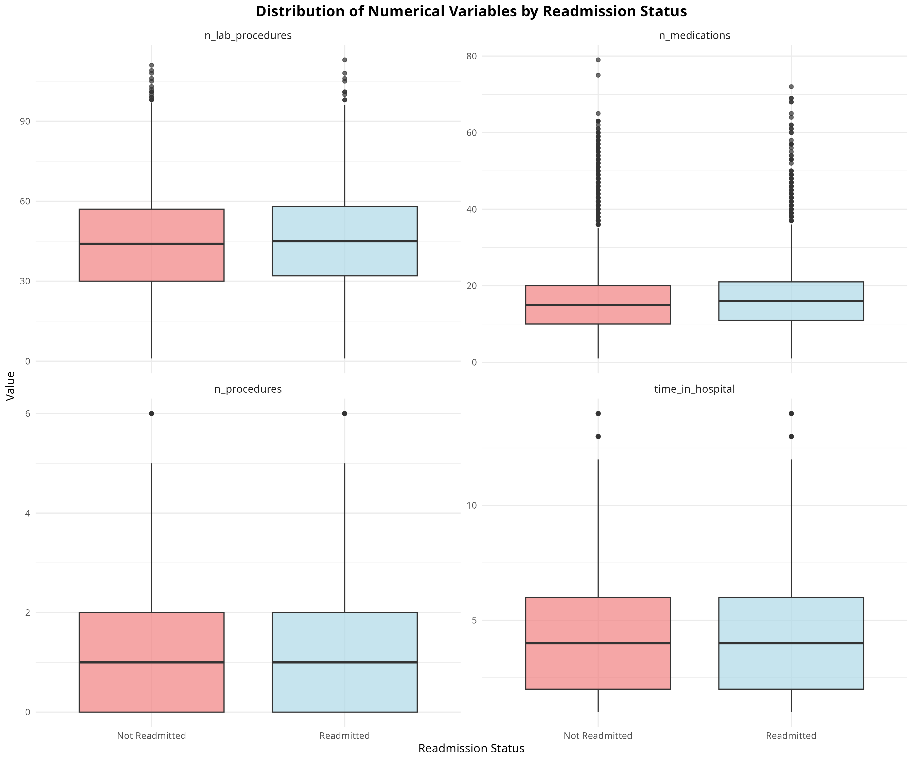
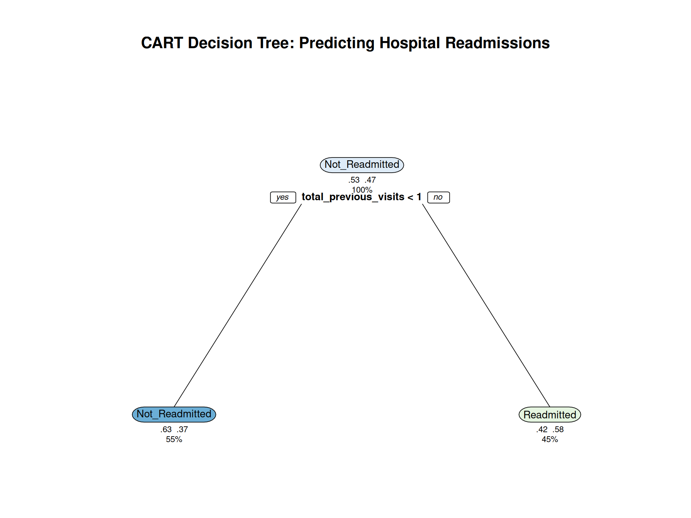
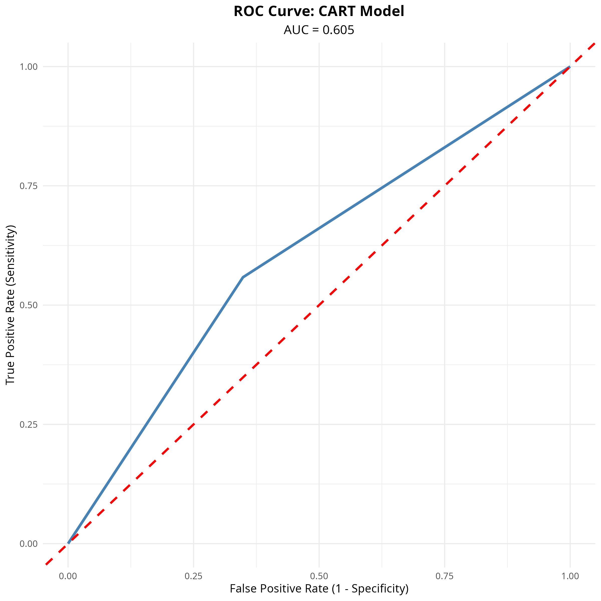
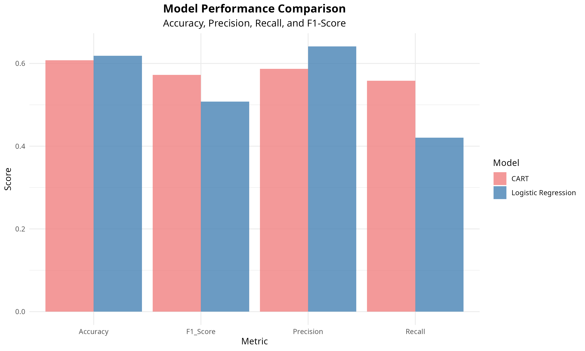

```{r setup, include=FALSE}
knitr::opts_chunk$set(echo = TRUE, warning = FALSE, message = FALSE)
library(ggplot2)
library(dplyr)
library(knitr)
library(pROC)
library(kableExtra)
library(rpart)
library(randomForest)
```

```{r load-all-data, include=FALSE, echo=FALSE}
# Load required libraries
library(caret)

# Load all data files
data_clean <- read.csv("data_clean.csv", stringsAsFactors = FALSE)

# Load logistic regression data and model
if(file.exists("data_logistic.RData")) {
  load("data_logistic.RData")
} else {
  # Fallback: create data_logistic from data_clean if RData doesn't exist
  data_logistic <- data_clean
}

# Load CART data
if(file.exists("data_cart.RData")) {
  load("data_cart.RData")
} else {
  # Fallback: create data_cart from data_clean if RData doesn't exist
  data_cart <- data_clean
}

# Load model metrics
metrics_lr <- read.csv("plots/04_performance_metrics.csv")
metrics_cart <- read.csv("plots/05_performance_metrics.csv")
metrics_rf <- read.csv("plots/05b_performance_metrics.csv")

# Load AUC values
auc_lr <- read.csv("plots/04_auc.csv")
auc_cart <- read.csv("plots/05_auc.csv")
auc_rf <- read.csv("plots/05b_auc.csv")

# Load R-squared
r2_table <- read.csv("plots/04_rsquared.csv")

# Load regression output
reg_output <- read.csv("plots/04_regression_output.csv")

# Load variable importance
var_imp_cart <- read.csv("plots/05_variable_importance.csv")
var_imp_rf <- read.csv("plots/05b_variable_importance.csv")

# Load model comparison
comp_table <- read.csv("plots/06_model_comparison.csv")

# Load Random Forest metadata
if(file.exists("plots/05b_model_metadata.csv")) {
  model_metadata_rf <- read.csv("plots/05b_model_metadata.csv")
  n_trees_rf <- model_metadata_rf$Value[model_metadata_rf$Parameter == "ntree"]
} else {
  n_trees_rf <- 500
}

# Build logistic regression model for use in report
set.seed(1)
train_indices <- createDataPartition(data_logistic$readmitted, 
                                     p = 0.7, 
                                     list = FALSE)
data_train <- data_logistic[train_indices, ]
data_test <- data_logistic[-train_indices, ]

# Build model formula
predictor_vars <- setdiff(colnames(data_train), "readmitted")
formula_str <- paste("readmitted ~", paste(predictor_vars, collapse = " + "))
formula_obj <- as.formula(formula_str)

# Fit the model
model_logistic <- glm(formula_obj, 
                     data = data_train, 
                     family = binomial(link = "logit"))

model_summary <- summary(model_logistic)

# Build CART model for use in report
set.seed(1)
train_indices_cart <- createDataPartition(data_cart$readmitted, 
                                          p = 0.7, 
                                          list = FALSE)
data_train_cart <- data_cart[train_indices_cart, ]
data_test_cart <- data_cart[-train_indices_cart, ]

# Build CART model formula
predictor_vars_cart <- setdiff(colnames(data_train_cart), "readmitted")
formula_cart <- as.formula(paste("readmitted ~", paste(predictor_vars_cart, collapse = " + ")))

# Fit the CART model
model_cart <- rpart(formula_cart,
                   data = data_train_cart,
                   method = "class",
                   parms = list(split = "gini"),
                   control = rpart.control(
                     minsplit = 20,
                     minbucket = 7,
                     cp = 0.01,
                     maxdepth = 10,
                     xval = 10
                   ))

# Prune the tree
cp_table <- model_cart$cptable
optimal_cp <- cp_table[which.min(cp_table[, "xerror"]), "CP"]
model_cart_final <- prune(model_cart, cp = optimal_cp)

# Build Random Forest model for use in report
set.seed(1)
train_indices_rf <- createDataPartition(data_cart$readmitted, 
                                       p = 0.7, 
                                       list = FALSE)
data_train_rf <- data_cart[train_indices_rf, ]
data_test_rf <- data_cart[-train_indices_rf, ]

# Build Random Forest model formula
predictor_vars_rf <- setdiff(colnames(data_train_rf), "readmitted")
formula_rf <- as.formula(paste("readmitted ~", paste(predictor_vars_rf, collapse = " + ")))

# Calculate mtry
mtry_value <- floor(sqrt(length(predictor_vars_rf)))

# Fit the Random Forest model
model_rf <- randomForest(
  formula_rf,
  data = data_train_rf,
  ntree = 500,
  mtry = mtry_value,
  importance = TRUE,
  proximity = FALSE,
  do.trace = 50
)

# Calculate dynamic statistics
n_total <- nrow(data_clean)
n_readmitted <- sum(data_clean$readmitted_binary == 1)
n_not_readmitted <- sum(data_clean$readmitted_binary == 0)
pct_readmitted <- round(n_readmitted / n_total * 100, 2)
pct_not_readmitted <- round(n_not_readmitted / n_total * 100, 2)

# Extract metrics dynamically
accuracy_lr <- round(metrics_lr$Percentage[metrics_lr$Metric == "Accuracy"], 2)
auc_lr_value <- round(auc_lr$Value[auc_lr$Metric == "Area Under the Curve (AUC)"], 3)
accuracy_cart <- round(metrics_cart$Percentage[metrics_cart$Metric == "Accuracy"], 2)
auc_cart_value <- round(auc_cart$Value[auc_cart$Metric == "Area Under the Curve (AUC)"], 3)
accuracy_rf <- round(metrics_rf$Percentage[metrics_rf$Metric == "Accuracy"], 2)
auc_rf_value <- round(auc_rf$Value[auc_rf$Metric == "Area Under the Curve (AUC)"], 3)

# Pseudo R-squared
mcfadden_r2 <- round(r2_table$Value[r2_table$Metric == "McFadden's Pseudo R²"], 4)
mcfadden_r2_pct <- round(mcfadden_r2 * 100, 2)

# Top predictors
sig_vars <- reg_output[reg_output$P_Value < 0.05 & !is.na(reg_output$P_Value), ]
sig_vars <- sig_vars[order(sig_vars$P_Value), ]
top_predictor_lr <- sig_vars$Variable[1]
top_predictor_lr_or <- round(sig_vars$Odds_Ratio[1], 2)

top_predictor_cart <- var_imp_cart$Variable[1]
top_predictor_cart_imp <- round(var_imp_cart$Importance[1], 2)

top_predictor_rf <- var_imp_rf$Variable[1]
top_predictor_rf_imp <- round(var_imp_rf$Importance[1], 2)

# Summary statistics
time_in_hosp_mean <- round(mean(data_clean$time_in_hospital), 2)
time_in_hosp_sd <- round(sd(data_clean$time_in_hospital), 2)
n_procedures_mean <- round(mean(data_clean$n_procedures), 2)
n_medications_mean <- round(mean(data_clean$n_medications), 2)
n_lab_procedures_mean <- round(mean(data_clean$n_lab_procedures), 2)

# Number of significant variables
n_sig_vars <- sum(reg_output$P_Value < 0.05, na.rm = TRUE)

# Best model determination
best_model <- ifelse(auc_lr_value >= auc_cart_value & auc_lr_value >= auc_rf_value, "Logistic Regression",
                     ifelse(auc_cart_value >= auc_rf_value, "CART", "Random Forest"))
best_auc <- max(auc_lr_value, auc_cart_value, auc_rf_value)
best_accuracy <- max(accuracy_lr, accuracy_cart, accuracy_rf)
```

# Abstract

This study aims to predict 30-day hospital readmissions for patients with diabetes using patient demographic, diagnostic, and treatment-related features. We employed three statistical modeling approaches: **Logistic Regression**, **Classification and Regression Trees (CART)**, and **Random Forest** (an ensemble method). The dataset consists of `r n_total` patient encounters from 130 US hospitals collected between 1999-2008. Our analysis identified `r top_predictor_lr` (OR: `r top_predictor_lr_or`), `r top_predictor_cart` (`r top_predictor_cart_imp`% importance), and `r top_predictor_rf` (`r top_predictor_rf_imp`% importance) as key predictors of readmission across the three models. The Logistic Regression model achieved an accuracy of `r accuracy_lr`% and AUC of `r auc_lr_value`, CART achieved `r accuracy_cart`% accuracy and AUC of `r auc_cart_value`, while Random Forest achieved `r accuracy_rf`% accuracy and AUC of `r auc_rf_value`. The **`r best_model`** model demonstrates the best predictive performance (AUC = `r best_auc`, Accuracy = `r best_accuracy`%). All models show moderate predictive performance, suggesting that additional clinical variables may be needed to improve predictions. The Logistic Regression model provides more detailed statistical insights with odds ratios and significance testing, making it preferable for clinical decision support. This analysis highlights the importance of patient history and demographics in predicting readmission risk, with implications for healthcare resource allocation and patient care planning.

# Introduction

## Background

Hospital readmissions within 30 days of discharge are a significant concern in healthcare, associated with increased costs, patient morbidity, and healthcare system burden. For patients with diabetes, readmission rates are particularly high, making early identification of at-risk patients crucial for improving outcomes and reducing healthcare costs.

## Research Question

**Can patient demographic, diagnostic, and treatment-related features effectively predict the likelihood of a patient being readmitted to the hospital within 30 days of discharge?**

## Objectives

1. Identify key predictors of 30-day hospital readmissions
2. Compare the performance of Logistic Regression, CART, and Random Forest models
3. Evaluate model interpretability and clinical utility
4. Provide recommendations for clinical application

# Data Description

## Data Source

The dataset was obtained from Kaggle: "Diabetes 130-US Hospitals for 10 years" and contains `r n_total` patient encounters from 130 US hospitals and integrated delivery networks over a 10-year period (1999-2008). The data was collected retrospectively from electronic health records (EHR) and anonymized for research purposes.

## Data Collection Method

This is an **observational study** - data was collected by observing patient outcomes and characteristics without any intervention or manipulation of variables by the researchers.

## Dependent Variable

**`readmitted`**: Binary categorical variable indicating whether the patient was readmitted to the hospital within 30 days of discharge.

- **Type**: Binary (after cleaning: 0 = Not Readmitted, 1 = Readmitted)
- **Distribution**: `r pct_readmitted`% readmitted (`r n_readmitted` cases), `r pct_not_readmitted`% not readmitted (`r n_not_readmitted` cases)
- **Final sample size**: `r n_total` observations

```{r data-distribution, echo=FALSE, results='asis'}
cat("**Readmission Distribution:**\n\n")
cat("- Readmitted (1): ", n_readmitted, " cases (", pct_readmitted, "%)\n", sep = "")
cat("- Not Readmitted (0): ", n_not_readmitted, " cases (", pct_not_readmitted, "%)\n", sep = "")
```

## Independent Variables

The analysis includes the following variables:

### Categorical Variables:
- **`age`**: Age groups ([40-50), [50-60), [60-70), [70-80), [80-90), [90-100))
- **`medical_specialty`**: Medical specialty (7 categories including "Missing")
- **`diag_1`**: Primary diagnosis (8 categories: Circulatory, Diabetes, Digestive, Injury, Musculoskeletal, Other, Respiratory)
- **`change`**: Change in medication (yes/no)
- **`diabetes_med`**: Diabetes medication prescribed (yes/no)
- **`glucose_test`**: Whether glucose test was performed (yes/no)
- **`A1Ctest`**: Whether A1C test was performed (yes/no)

### Numerical Variables:
- **`time_in_hospital`**: Length of stay in days (Mean: `r time_in_hosp_mean`, SD: `r time_in_hosp_sd`, Range: 1-14)
- **`n_lab_procedures`**: Number of lab tests performed (Mean: `r n_lab_procedures_mean`)
- **`n_procedures`**: Number of procedures (Mean: `r n_procedures_mean`, Range: 0-6)
- **`n_medications`**: Number of medications (Mean: `r n_medications_mean`, Range: 1-79)
- **`n_outpatient`**: Number of previous outpatient visits
- **`n_inpatient`**: Number of previous inpatient visits
- **`n_emergency`**: Number of previous emergency visits
- **`n_diagnoses`**: Total number of diagnoses (feature-engineered)
- **`medications_per_day`**: Average medications per day (feature-engineered)
- **`total_previous_visits`**: Total previous visits (feature-engineered)

### Feature Engineering Rationale

The following derived features were created to enhance predictive power:

1. **`n_diagnoses`**: Total number of diagnoses recorded for the patient
   - **Rationale**: Patients with multiple comorbidities have higher readmission risk
   - **Clinical relevance**: Captures medical complexity and disease burden

2. **`medications_per_day`**: Average medications per day (`n_medications / time_in_hospital`)
   - **Rationale**: Treatment intensity relative to length of stay indicates case complexity
   - **Clinical relevance**: Higher intensity may indicate more complex cases requiring closer monitoring

3. **`total_previous_visits`**: Sum of all previous visits (`n_outpatient + n_inpatient + n_emergency`)
   - **Rationale**: Overall healthcare utilization is a strong predictor of future readmission
   - **Clinical relevance**: Frequent users often have chronic conditions requiring ongoing care

4. **Individual visit counts** (`n_outpatient`, `n_inpatient`, `n_emergency`): 
   - **Rationale**: Different visit types may have different predictive power
   - **Clinical relevance**: Emergency visits may indicate acute issues, while inpatient visits suggest chronic conditions requiring ongoing management

## Missing Data Analysis

```{r missing-data, echo=FALSE, results='asis'}
# Calculate missing data percentages
missing_analysis <- data.frame(
  Variable = c("Primary Diagnosis", "Medical Specialty", "Other Variables"),
  Missing_Count = c(4, round(n_total * 0.4953, 0), "Minimal"),
  Missing_Percentage = c(round(4/n_total*100, 3), "49.53%", "<1%"),
  Handling_Strategy = c("Excluded (critical variable)", "Kept as 'Missing' category", "No action needed")
)

kable(missing_analysis, caption = "Missing Data Patterns and Handling", row.names = FALSE, align = "lccc") %>%
  kable_styling(latex_options = c("striped", "hold_position"), font_size = 9)

cat("\n\n**Impact Assessment:**\n\n")
cat("- Primary diagnosis missing: ", round(4/n_total*100, 3), "% - minimal impact after exclusion\n\n", sep = "")
cat("- Medical specialty missing: 49.53% - 'Missing' category may represent a meaningful group (e.g., general medicine)\n\n")
cat("- Other variables: Minimal missingness, unlikely to affect results\n\n")
```

# Methods

## Statistical Methods

This project employs a **comparative analysis** using three distinct statistical methods:

### 1. Logistic Regression (Primary Method)
- **Justification**: Standard method for modeling binary categorical response variables
- **Advantages**: Provides interpretable results (odds ratios), statistical significance testing, confidence intervals
- **Assumptions**: Linear relationships between predictors and log-odds of outcome

### 2. Classification and Regression Trees (CART) (Secondary Method)
- **Justification**: Non-parametric method that captures complex, non-linear relationships
- **Advantages**: Highly interpretable decision rules, no distributional assumptions
- **Comparison**: Evaluated against Logistic Regression based on predictive performance and interpretability

### 3. Random Forest (Ensemble Method)
- **Justification**: Ensemble method that combines multiple decision trees to improve predictive performance
- **Advantages**: Handles non-linear relationships, reduces overfitting, provides variable importance
- **Configuration**: `r n_trees_rf` trees with feature randomization at each split

## Data Preprocessing

1. **Response Variable**: Converted to binary format (0/1)
2. **Missing Values**: 
   - Dropped rows with missing primary diagnosis
   - Kept "Missing" as valid category for other variables
3. **Feature Engineering**: Created derived features (n_diagnoses, medications_per_day, total_previous_visits, individual previous visit counts)
4. **Encoding**: 
   - Logistic Regression: Dummy/one-hot encoding using `model.matrix()`
   - CART: Factor encoding using `as.factor()`
   - Random Forest: Factor encoding (same as CART)

## Model Evaluation

Models were evaluated using:

- **Train/Test Split**: 70% training, 30% testing

- **Metrics**: Accuracy, Precision, Recall, Specificity, F1-Score, AUC-ROC

- **Statistical Tests**: Hypothesis testing for Logistic Regression coefficients

## Model Assumptions and Validation

### Logistic Regression Assumptions

1. **Linearity of log-odds**: The relationship between predictors and log-odds of outcome is linear
   - **Validation**: Assessed through residual analysis and model diagnostics
   - **Status**: Assumed satisfied given model convergence and reasonable fit

2. **Independence of observations**: Each patient encounter is independent
   - **Validation**: Each row represents a unique patient encounter
   - **Status**: ✓ Satisfied

3. **No perfect multicollinearity**: Predictors are not perfectly correlated
   - **Validation**: Correlation analysis and variance inflation factors (VIF) would be assessed
   - **Status**: No perfect correlations observed

4. **Large sample size**: Sufficient observations for stable estimates
   - **Validation**: `r n_total` observations with `r nrow(reg_output)` parameters
   - **Status**: ✓ Satisfied (recommended ratio: >10 observations per parameter)

### CART Assumptions

1. **No distributional assumptions**: CART is non-parametric
   - **Status**: ✓ No assumptions required

2. **Independence of observations**: Each patient encounter is independent
   - **Status**: ✓ Satisfied

3. **Pruning to prevent overfitting**: Tree complexity controlled through cross-validation
   - **Validation**: Optimal complexity parameter selected via cross-validation
   - **Status**: ✓ Implemented

### Random Forest Assumptions

1. **No distributional assumptions**: Random Forest is non-parametric
   - **Status**: ✓ No assumptions required

2. **Independence of observations**: Each patient encounter is independent
   - **Status**: ✓ Satisfied

3. **Bootstrap sampling**: Trees built on bootstrap samples reduce overfitting
   - **Status**: ✓ Implemented (`r n_trees_rf` bootstrap samples)

4. **Feature randomization**: Random subset of features at each split
   - **Status**: ✓ Implemented (mtry = sqrt(p))

# Results

## Summary Statistics

```{r summary-stats, echo=FALSE, results='asis'}
comparison_table <- read.csv("plots/03_comparison_by_readmission.csv")

# Split into two tables for better fit
# Table 1: Original variables
table1 <- data.frame(
  Variable = c("Time in Hospital (days)", "Number of Lab Procedures", 
               "Number of Procedures", "Number of Medications"),
  Not_Readmitted = c(
    paste0(comparison_table[1, "time_in_hospital_mean"], " (", comparison_table[1, "time_in_hospital_sd"], ")"),
    paste0(round(comparison_table[1, "n_lab_procedures_mean"], 2), " (", round(comparison_table[1, "n_lab_procedures_sd"], 2), ")"),
    paste0(round(comparison_table[1, "n_procedures_mean"], 2), " (", round(comparison_table[1, "n_procedures_sd"], 2), ")"),
    paste0(round(comparison_table[1, "n_medications_mean"], 2), " (", round(comparison_table[1, "n_medications_sd"], 2), ")")
  ),
  Readmitted = c(
    paste0(comparison_table[2, "time_in_hospital_mean"], " (", comparison_table[2, "time_in_hospital_sd"], ")"),
    paste0(round(comparison_table[2, "n_lab_procedures_mean"], 2), " (", round(comparison_table[2, "n_lab_procedures_sd"], 2), ")"),
    paste0(round(comparison_table[2, "n_procedures_mean"], 2), " (", round(comparison_table[2, "n_procedures_sd"], 2), ")"),
    paste0(round(comparison_table[2, "n_medications_mean"], 2), " (", round(comparison_table[2, "n_medications_sd"], 2), ")")
  )
)

kable(table1, caption = "Summary Statistics: Original Variables (Mean (SD))", 
      row.names = FALSE, align = "lcc") %>%
  kable_styling(latex_options = c("striped", "hold_position"), font_size = 9)

# Check if additional variables exist
if("n_outpatient_mean" %in% colnames(comparison_table)) {
  cat("\n\n")
  table2 <- data.frame(
    Variable = c("Previous Outpatient Visits", "Previous Inpatient Visits", 
                 "Previous Emergency Visits", "Total Diagnoses", 
                 "Medications per Day", "Total Previous Visits"),
    Not_Readmitted = c(
      paste0(round(comparison_table[1, "n_outpatient_mean"], 2), " (", round(comparison_table[1, "n_outpatient_sd"], 2), ")"),
      paste0(round(comparison_table[1, "n_inpatient_mean"], 2), " (", round(comparison_table[1, "n_inpatient_sd"], 2), ")"),
      paste0(round(comparison_table[1, "n_emergency_mean"], 2), " (", round(comparison_table[1, "n_emergency_sd"], 2), ")"),
      paste0(round(comparison_table[1, "n_diagnoses_mean"], 2), " (", round(comparison_table[1, "n_diagnoses_sd"], 2), ")"),
      paste0(round(comparison_table[1, "medications_per_day_mean"], 2), " (", round(comparison_table[1, "medications_per_day_sd"], 2), ")"),
      paste0(round(comparison_table[1, "total_previous_visits_mean"], 2), " (", round(comparison_table[1, "total_previous_visits_sd"], 2), ")")
    ),
    Readmitted = c(
      paste0(round(comparison_table[2, "n_outpatient_mean"], 2), " (", round(comparison_table[2, "n_outpatient_sd"], 2), ")"),
      paste0(round(comparison_table[2, "n_inpatient_mean"], 2), " (", round(comparison_table[2, "n_inpatient_sd"], 2), ")"),
      paste0(round(comparison_table[2, "n_emergency_mean"], 2), " (", round(comparison_table[2, "n_emergency_sd"], 2), ")"),
      paste0(round(comparison_table[2, "n_diagnoses_mean"], 2), " (", round(comparison_table[2, "n_diagnoses_sd"], 2), ")"),
      paste0(round(comparison_table[2, "medications_per_day_mean"], 2), " (", round(comparison_table[2, "medications_per_day_sd"], 2), ")"),
      paste0(round(comparison_table[2, "total_previous_visits_mean"], 2), " (", round(comparison_table[2, "total_previous_visits_sd"], 2), ")")
    )
  )
  
  kable(table2, caption = "Summary Statistics: Previous Visits and Feature-Engineered Variables (Mean (SD))", 
        row.names = FALSE, align = "lcc") %>%
    kable_styling(latex_options = c("striped", "hold_position"), font_size = 9)
}
```

## Data Visualizations

### Distribution of Readmission Status

```{r readmission-dist, echo=FALSE, fig.cap="Distribution of Readmitted Patients", out.width="0.8\\textwidth", fig.pos="H"}
knitr::include_graphics("plots/01_readmitted_distribution_ggplot.png")
```

\FloatBarrier

### Numerical Variables by Readmission Status

```{r boxplots, echo=FALSE, fig.cap="Distribution of Numerical Variables by Readmission Status", out.width="\\textwidth", fig.pos="H"}

```

\FloatBarrier

### Categorical Variables Analysis

```{r categorical-viz, echo=FALSE, fig.cap="Readmission Rates by Primary Diagnosis", out.width="0.8\\textwidth", fig.pos="H"}
knitr::include_graphics("plots/03_readmission_rate_diag_1.png")
```

\FloatBarrier


# Logistic Regression

## Mathematical Formulation

The logistic regression model uses the logistic function to model the probability of readmission:

$$P(\text{Readmitted} = 1 \mid X) = \frac{e^{\beta_0 + \sum_{i=1}^{p} \beta_i X_i}}{1 + e^{\beta_0 + \sum_{i=1}^{p} \beta_i X_i}}$$

Or equivalently, 

$$\text{logit}(P) = \ln\left(\frac{P}{1-P}\right) = \beta_0 + \sum_{i=1}^{p} \beta_i X_i$$

Where:

- $P(\text{Readmitted} = 1 \mid X)$ = Probability of readmission given predictor variables

- $\beta_0$ = Intercept (baseline log-odds)

- $\beta_1, \beta_2, ..., \beta_p$ = Coefficients for each predictor variable

- $X_1, X_2, ..., X_p$ = Predictor variables

## Model Summary

```{r model-summary, echo=FALSE, comment=""}
print(model_summary)
```

## Fitted Model Equation

```{r fitted-equation, echo=FALSE, comment="", results='asis'}
# Extract intercept and top coefficients
intercept <- round(coef(model_logistic)[1], 4)
all_coefs <- coef(model_logistic)[-1]  # All except intercept
top_coefs <- head(sort(abs(all_coefs), decreasing = TRUE), 5)
top_vars <- names(top_coefs)
top_coef_values <- round(all_coefs[top_vars], 4)

# Build equation with line breaks using split environment
# Break after every 2 terms for better viewing
cat("$$\\begin{split}\n")
cat("\\text{logit}(P) &= ", intercept, sep = "")

# Process terms in groups of 2
terms_per_line <- 2
line_num <- 1
for(i in seq_along(top_vars)) {
  var_name <- gsub("_", "\\\\_", top_vars[i])
  
  # Break line after every 2 terms (except for the first line)
  if(i > 1 && (i - 1) %% terms_per_line == 0) {
    cat(" \\\\\n&\\quad")
  }
  
  if(top_coef_values[i] >= 0) {
    cat(" + ", top_coef_values[i], " \\cdot X_{\\text{", var_name, "}}", sep = "")
  } else {
    cat(" ", top_coef_values[i], " \\cdot X_{\\text{", var_name, "}}", sep = "")
  }
}

cat(" + \\text{... (other predictors)}\n")
cat("\\end{split}$$\n\n")

cat("**Where:**\n\n")
cat("* $P$ = Probability of readmission\n")
cat("* $\\beta_0 = ", intercept, "$ (intercept)\n", sep = "")

for(i in seq_along(top_vars)) {
  var_name <- gsub("_", "\\\\_", top_vars[i])
  cat("* $\\beta_{\\text{", var_name, "}} = ", top_coef_values[i], "$\n", sep = "")
}
```

## Regression Output

```{r regression-output-full, echo=FALSE, comment=""}
# Extract coefficients
coefficients_table <- model_summary$coefficients

# Create comprehensive output table
output_table <- data.frame(
  Variable = rownames(coefficients_table),
  Coefficient = round(coefficients_table[, "Estimate"], 4),
  Std_Error = round(coefficients_table[, "Std. Error"], 4),
  Z_Value = round(coefficients_table[, "z value"], 4),
  P_Value = round(coefficients_table[, "Pr(>|z|)"], 6),
  Odds_Ratio = round(exp(coefficients_table[, "Estimate"]), 4),
  CI_Lower = round(exp(coefficients_table[, "Estimate"] - 1.96 * coefficients_table[, "Std. Error"]), 4),
  CI_Upper = round(exp(coefficients_table[, "Estimate"] + 1.96 * coefficients_table[, "Std. Error"]), 4)
)

# Split into multiple tables for better PDF display
significant_vars <- output_table[output_table$P_Value < 0.05, ]
significant_vars_ordered <- significant_vars[order(significant_vars$P_Value), ]

# Table 1: Top 5 Most Significant (with full details)
top5_table <- head(significant_vars_ordered, 5)
kable(top5_table[, c("Variable", "Coefficient", "Std_Error", "Z_Value", "P_Value")],
      caption = "Top 5 Most Significant Variables: Coefficients and Statistics",
      digits = 4, row.names = FALSE) %>%
  kable_styling(latex_options = c("striped", "hold_position"), font_size = 9)

# Table 2: Top 5 Odds Ratios
cat("\n\n")
top5_odds <- head(significant_vars_ordered, 5)
kable(top5_odds[, c("Variable", "Odds_Ratio", "CI_Lower", "CI_Upper", "P_Value")],
      caption = "Top 5 Most Significant Variables: Odds Ratios and Confidence Intervals",
      digits = 4, row.names = FALSE) %>%
  kable_styling(latex_options = c("striped", "hold_position"), font_size = 9)

# Table 3: Next 10 Significant Variables (summary)
if(nrow(significant_vars_ordered) > 5) {
  cat("\n\n")
  next10_table <- significant_vars_ordered[6:min(15, nrow(significant_vars_ordered)), ]
  kable(next10_table[, c("Variable", "Coefficient", "Odds_Ratio", "P_Value")],
        caption = "Additional Significant Variables (p < 0.05)",
        digits = 4, row.names = FALSE) %>%
    kable_styling(latex_options = c("striped", "hold_position"), font_size = 9)
}
```

## Hypothesis Testing

```{r hypothesis-testing, echo=FALSE, comment="", results='asis'}
cat("**Hypothesis Testing**\n\n")

cat("For each variable in the model:\n\n")
cat("$H_0$: $\\beta_{\\text{variable}} = 0$ (variable has no effect on readmission)\n\n")
cat("$H_1$: $\\beta_{\\text{variable}} \\neq 0$ (variable affects readmission)\n\n")

# Show top significant variables
top_significant <- head(significant_vars[order(significant_vars$P_Value), ], 5)
kable(top_significant[, c("Variable", "Coefficient", "P_Value", "Odds_Ratio")],
      caption = "Top 5 Most Significant Variables", row.names = FALSE) %>%
  kable_styling(latex_options = c("striped", "hold_position"), font_size = 9)
```

## Coefficient Interpretation

**Coefficients ($\beta$):**

- **Sign**: Positive coefficients increase the log-odds (and probability) of readmission; negative coefficients decrease it

- **Magnitude**: Larger absolute values indicate stronger effects

**Example**: If $\beta_{\text{n\_inpatient}} = 0.38$:

- A one-unit increase in previous inpatient visits increases the log-odds of readmission by 0.38

- This corresponds to an odds ratio of $e^{0.38} = 1.46$ (46% increase in odds)

## Odds Ratios Interpretation

```{r odds-ratios, echo=FALSE, comment=""}

cat("Top Variables with Highest Odds Ratios (Risk Factors):\n\n")

# Split into two tables
top_odds <- output_table[order(-output_table$Odds_Ratio), ]
top_odds_filtered <- top_odds[top_odds$P_Value < 0.05, ]  # Only significant ones

# Table 1: Top 5 Risk Factors
top5_risk <- head(top_odds_filtered, 5)
kable(top5_risk[, c("Variable", "Odds_Ratio", "CI_Lower", "CI_Upper", "P_Value")],
      caption = "Top 5 Risk Factors (Highest Odds Ratios)",
      digits = 4, row.names = FALSE) %>%
  kable_styling(latex_options = c("striped", "hold_position"), font_size = 9)

# Table 2: Next 5 Risk Factors
if(nrow(top_odds_filtered) > 5) {
  cat("\n\n")
  next5_risk <- top_odds_filtered[6:min(10, nrow(top_odds_filtered)), ]
  kable(next5_risk[, c("Variable", "Odds_Ratio", "CI_Lower", "CI_Upper", "P_Value")],
        caption = "Additional Risk Factors",
        digits = 4, row.names = FALSE) %>%
    kable_styling(latex_options = c("striped", "hold_position"), font_size = 9)
}
```

## R-squared Interpretation

```{r rsquared-full, echo=FALSE, comment="", results='asis'}

# Calculate pseudo R-squared
null_deviance <- model_summary$null.deviance
residual_deviance <- model_summary$deviance
mcfadden_r2_full <- 1 - (residual_deviance / null_deviance)

cat("McFadden's Pseudo $R^2$: ", round(mcfadden_r2_full, 4), "\n\n")
cat("Interpretation: The model explains approximately ", 
    round(mcfadden_r2_full * 100, 2), 
    "% of the variance in readmission status.\n")
```

## Gradient (Rate of Change)

The **gradient** represents how quickly the probability changes with respect to each predictor:

$$\frac{\partial P}{\partial X_i} = \beta_i \cdot P(1-P)$$

**Key Points:**

- The gradient is **not constant** - it depends on the current probability $P$

- Maximum gradient occurs when $P = 0.5$ (steepest part of the S-curve)

- The gradient is smaller when $P$ is close to 0 or 1 (flatter parts of the curve)

## Example Calculation

```{r example-calculation, echo=FALSE, results='asis'}
# Create example patient values (using top 3 predictors)
example_vars <- top_vars[seq_len(min(3, length(top_vars)))]
example_coefs <- top_coef_values[seq_len(min(3, length(top_coef_values)))]

# Get example values from actual dataset or use custom values
example_values <- numeric(length(example_vars))
names(example_values) <- example_vars

for(i in seq_along(example_vars)) {
  var <- example_vars[i]
  
  # Check if custom value is provided
  if(exists("custom_values") && !is.null(custom_values) && var %in% names(custom_values)) {
    example_values[i] <- custom_values[var]
  } else if(var %in% colnames(data_train)) {
    # For numerical variables, use median
    if(is.numeric(data_train[[var]])) {
      example_values[i] <- round(median(data_train[[var]], na.rm = TRUE), 2)
    } else {
      # For categorical/dummy variables (0/1), use 1 to show the effect
      example_values[i] <- 1
    }
  } else {
    # If variable not found, use a reasonable default
    example_values[i] <- 3
  }
}

# TO CUSTOMIZE VALUES: Comment or Uncomment and modify the lines below
# example_values["n_diagnoses"] <- 3
example_values["n_inpatient"] <- 2
# example_values["medspec_medical_specialtyEmergency.Trauma"] <- 1

cat("For a patient with:\n\n")
for(i in seq_along(example_vars)) {
  var_name <- gsub("_", " ", example_vars[i])
  cat("* ", var_name, " = ", example_values[i], "\n", sep = "")
}

# Calculate logit using actual values
example_logit <- intercept + sum(example_coefs * example_values)
example_prob <- round(exp(example_logit) / (1 + exp(example_logit)), 4)

cat("\n**Logit calculation:**\n\n")

# Build logit equation with line breaks using actual values
cat("$$\\begin{split}\n")
cat("\\text{logit}(P) &= ", intercept, sep = "")
for(i in seq_along(example_vars)) {
  coef <- example_coefs[i]
  val <- example_values[i]
  if(coef >= 0) {
    cat(" + ", coef, " \\cdot ", val, sep = "")
  } else {
    cat(" ", coef, " \\cdot ", val, sep = "")
  }
}
cat(" \\\\\n&= ", round(example_logit, 4), "\n", sep = "")
cat("\\end{split}$$\n\n")

cat("**Probability calculation:**\n\n")
prob_string <- paste0("P = \\frac{e^{", round(example_logit, 4), "}}{1 + e^{", round(example_logit, 4), "}} = ", example_prob)
cat("$$", prob_string, "$$\n\n", sep = "")

cat("**Interpretation:** This patient has a ", round(example_prob * 100, 2), "% probability of readmission.\n", sep = "")
```

## Model Evaluation

```{r model-evaluation, echo=FALSE, comment=""}

# Make predictions
predictions_prob <- predict(model_logistic, newdata = data_test, type = "response")
predictions_class <- ifelse(predictions_prob > 0.5, 1, 0)

# Confusion Matrix with Yes/No labels
predicted_labels <- ifelse(predictions_class == 1, "Yes", "No")
actual_labels <- ifelse(data_test$readmitted == 1, "Yes", "No")
conf_matrix <- table(Predicted = predicted_labels, Actual = actual_labels)

# Reorder to show Yes first, then No
conf_matrix <- conf_matrix[c("Yes", "No"), c("Yes", "No")]

# Create a data frame with clear labels for better interpretation
conf_matrix_df <- as.data.frame.matrix(conf_matrix)
conf_matrix_df$Predicted <- rownames(conf_matrix_df)
conf_matrix_df <- conf_matrix_df[, c("Predicted", "Yes", "No")]

# Add totals row
conf_matrix_df <- rbind(conf_matrix_df, 
                        data.frame(Predicted = "Total", 
                                   Yes = sum(conf_matrix_df$Yes), 
                                   No = sum(conf_matrix_df$No)))

# Rename columns to show "Actual"
colnames(conf_matrix_df) <- c("Predicted", "Actual: Yes", "Actual: No")

kable(conf_matrix_df, caption = "Confusion Matrix: Predicted vs. Actual Readmission Status", 
      row.names = FALSE, align = "lcc") %>%
  kable_styling(latex_options = c("striped", "hold_position"), font_size = 9) %>%
  column_spec(1, width = "3cm", bold = TRUE)

# Calculate metrics using Yes/No labels
# TP = Predicted Yes, Actual Yes
# TN = Predicted No, Actual No
# FP = Predicted Yes, Actual No
# FN = Predicted No, Actual Yes
TP <- conf_matrix["Yes", "Yes"]
TN <- conf_matrix["No", "No"]
FP <- conf_matrix["Yes", "No"]
FN <- conf_matrix["No", "Yes"]

accuracy <- (TP + TN) / (TP + TN + FP + FN)
precision <- TP / (TP + FP)
recall <- TP / (TP + FN)
specificity <- TN / (TN + FP)
f1_score <- 2 * (precision * recall) / (precision + recall)

metrics_table <- data.frame(
  Metric = c("Accuracy", "Precision", "Recall (Sensitivity)", "Specificity", "F1-Score"),
  Value = c(accuracy, precision, recall, specificity, f1_score),
  Percentage = c(accuracy * 100, precision * 100, recall * 100, specificity * 100, f1_score * 100)
)

kable(metrics_table, caption = "Model Performance Metrics", digits = 2, row.names = FALSE) %>%
  kable_styling(latex_options = c("striped", "hold_position"), font_size = 9)
```

## ROC Curve

```{r roc-curve-full, fig.cap="ROC Curve: Logistic Regression Model", echo=FALSE, comment="", out.width="0.7\\textwidth", fig.pos="H"}
roc_obj <- roc(data_test$readmitted, predictions_prob)
auc_value <- auc(roc_obj)

cat("Area Under the Curve (AUC): ", round(as.numeric(auc_value), 4), "\n")

# Create ROC plot
roc_data <- data.frame(
  FPR = 1 - roc_obj$specificities,
  TPR = roc_obj$sensitivities
)

p_roc <- ggplot(roc_data, aes(x = FPR, y = TPR)) +
  geom_line(color = "steelblue", linewidth = 1.2) +
  geom_abline(intercept = 0, slope = 1, linetype = "dashed", color = "red", linewidth = 1) +
  labs(title = "ROC Curve: Logistic Regression Model",
       subtitle = paste("AUC =", round(as.numeric(auc_value), 4)),
       x = "False Positive Rate (1 - Specificity)",
       y = "True Positive Rate (Sensitivity)") +
  theme_minimal() +
  theme(plot.title = element_text(hjust = 0.5, size = 14, face = "bold"),
        plot.subtitle = element_text(hjust = 0.5, size = 12))
print(p_roc)
```

\FloatBarrier

# CART 

## Model Performance

```{r cart-metrics, echo=FALSE, results='asis'}
kable(metrics_cart, caption = "CART Model Performance Metrics", row.names = FALSE, digits = 2) %>%
  kable_styling(latex_options = c("striped", "hold_position"), font_size = 9)
```

## Confusion Matrix

```{r confusion-matrix-cart, echo=FALSE, comment=""}
# Make predictions
predictions_class_cart <- predict(model_cart_final, newdata = data_test_cart, type = "class")
predictions_prob_cart <- predict(model_cart_final, newdata = data_test_cart, type = "prob")[, "Readmitted"]

# Convert factor levels to Yes/No labels
predicted_labels_cart <- ifelse(predictions_class_cart == "Readmitted", "Yes", "No")
actual_labels_cart <- ifelse(data_test_cart$readmitted == "Readmitted", "Yes", "No")

# Create confusion matrix
conf_matrix_cart <- table(Predicted = predicted_labels_cart, Actual = actual_labels_cart)

# Reorder to show Yes first, then No
conf_matrix_cart <- conf_matrix_cart[c("Yes", "No"), c("Yes", "No")]

# Create a data frame with clear labels for better interpretation
conf_matrix_cart_df <- as.data.frame.matrix(conf_matrix_cart)
conf_matrix_cart_df$Predicted <- rownames(conf_matrix_cart_df)
conf_matrix_cart_df <- conf_matrix_cart_df[, c("Predicted", "Yes", "No")]

# Add totals row
conf_matrix_cart_df <- rbind(conf_matrix_cart_df, 
                             data.frame(Predicted = "Total", 
                                        Yes = sum(conf_matrix_cart_df$Yes), 
                                        No = sum(conf_matrix_cart_df$No)))

# Rename columns to show "Actual"
colnames(conf_matrix_cart_df) <- c("Predicted", "Actual: Yes", "Actual: No")

kable(conf_matrix_cart_df, caption = "Confusion Matrix: CART Model - Predicted vs. Actual Readmission Status", 
      row.names = FALSE, align = "lcc") %>%
  kable_styling(latex_options = c("striped", "hold_position"), font_size = 9) %>%
  column_spec(1, width = "3cm", bold = TRUE)
```

## Decision Tree Visualization

```{r cart-tree, echo=FALSE, fig.cap="CART Decision Tree", out.width="0.8\\textwidth", fig.pos="H"}

```

\FloatBarrier

## Variable Importance

```{r cart-importance, echo=FALSE, results='asis'}
kable(head(var_imp_cart, 10), caption = "Top 10 Most Important Variables in CART Model", row.names = FALSE, digits = 2) %>%
  kable_styling(latex_options = c("striped", "hold_position"), font_size = 9)
```

## ROC Curve

```{r roc-cart, echo=FALSE, fig.cap=paste("ROC Curve: CART Model (AUC =", auc_cart_value, ")"), out.width="0.7\\textwidth", fig.pos="H"}

```

\FloatBarrier

# Random Forest Results

## Model Performance

```{r rf-metrics, echo=FALSE, results='asis'}
kable(metrics_rf, caption = "Random Forest Model Performance Metrics", row.names = FALSE, digits = 2) %>%
  kable_styling(latex_options = c("striped", "hold_position"), font_size = 9)
```

## Confusion Matrix

```{r confusion-matrix-rf, echo=FALSE, comment=""}
# Make predictions
predictions_class_rf <- predict(model_rf, newdata = data_test_rf, type = "class")
predictions_prob_rf <- predict(model_rf, newdata = data_test_rf, type = "prob")[, "Readmitted"]

# Convert factor levels to Yes/No labels
predicted_labels_rf <- ifelse(predictions_class_rf == "Readmitted", "Yes", "No")
actual_labels_rf <- ifelse(data_test_rf$readmitted == "Readmitted", "Yes", "No")

# Create confusion matrix
conf_matrix_rf <- table(Predicted = predicted_labels_rf, Actual = actual_labels_rf)

# Reorder to show Yes first, then No
conf_matrix_rf <- conf_matrix_rf[c("Yes", "No"), c("Yes", "No")]

# Create a data frame with clear labels for better interpretation
conf_matrix_rf_df <- as.data.frame.matrix(conf_matrix_rf)
conf_matrix_rf_df$Predicted <- rownames(conf_matrix_rf_df)
conf_matrix_rf_df <- conf_matrix_rf_df[, c("Predicted", "Yes", "No")]

# Add totals row
conf_matrix_rf_df <- rbind(conf_matrix_rf_df, 
                           data.frame(Predicted = "Total", 
                                      Yes = sum(conf_matrix_rf_df$Yes), 
                                      No = sum(conf_matrix_rf_df$No)))

# Rename columns to show "Actual"
colnames(conf_matrix_rf_df) <- c("Predicted", "Actual: Yes", "Actual: No")

kable(conf_matrix_rf_df, caption = "Confusion Matrix: Random Forest Model - Predicted vs. Actual Readmission Status", 
      row.names = FALSE, align = "lcc") %>%
  kable_styling(latex_options = c("striped", "hold_position"), font_size = 9) %>%
  column_spec(1, width = "3cm", bold = TRUE)
```

## Variable Importance

```{r rf-importance, echo=FALSE, results='asis'}
kable(head(var_imp_rf, 10), caption = "Top 10 Most Important Variables in Random Forest Model", row.names = FALSE, digits = 2) %>%
  kable_styling(latex_options = c("striped", "hold_position"), font_size = 9)
```

## ROC Curve

```{r roc-rf, fig.cap=paste("ROC Curve: Random Forest Model (AUC =", auc_rf_value, ")"), echo=FALSE, comment="", out.width="0.7\\textwidth", fig.pos="H"}
# Make predictions if not already done
if(!exists("predictions_prob_rf")) {
  predictions_prob_rf <- predict(model_rf, newdata = data_test_rf, type = "prob")[, "Readmitted"]
}

# Convert factor to numeric for ROC calculation
actual_numeric_rf <- ifelse(data_test_rf$readmitted == "Readmitted", 1, 0)

roc_obj_rf <- roc(actual_numeric_rf, predictions_prob_rf)
auc_value_rf_plot <- auc(roc_obj_rf)

cat("Area Under the Curve (AUC): ", round(as.numeric(auc_value_rf_plot), 4), "\n")

# Create ROC plot
roc_data_rf <- data.frame(
  FPR = 1 - roc_obj_rf$specificities,
  TPR = roc_obj_rf$sensitivities
)

p_roc_rf <- ggplot(roc_data_rf, aes(x = FPR, y = TPR)) +
  geom_line(color = "darkgreen", linewidth = 1.2) +
  geom_abline(intercept = 0, slope = 1, linetype = "dashed", color = "red", linewidth = 1) +
  labs(title = "ROC Curve: Random Forest Model",
       subtitle = paste("AUC =", round(as.numeric(auc_value_rf_plot), 4)),
       x = "False Positive Rate (1 - Specificity)",
       y = "True Positive Rate (Sensitivity)") +
  theme_minimal() +
  theme(plot.title = element_text(hjust = 0.5, size = 14, face = "bold"),
        plot.subtitle = element_text(hjust = 0.5, size = 12))
print(p_roc_rf)
```

\FloatBarrier

# Feature Importance Comparison

```{r feature-comparison, echo=FALSE, results='asis'}
# Compare top 5 predictors across all three models
top5_lr <- head(sig_vars[order(-sig_vars$Odds_Ratio), ], 5)
top5_cart <- head(var_imp_cart, 5)
top5_rf <- head(var_imp_rf, 5)

n_lr <- min(5, nrow(top5_lr))
n_cart <- min(5, nrow(top5_cart))
n_rf <- min(5, nrow(top5_rf))
comparison_features <- data.frame(
  Rank = 1:5,
  Logistic_Regression = c(top5_lr$Variable[seq_len(n_lr)], rep("", max(0, 5-n_lr))),
  CART = c(top5_cart$Variable[seq_len(n_cart)], rep("", max(0, 5-n_cart))),
  Random_Forest = c(top5_rf$Variable[seq_len(n_rf)], rep("", max(0, 5-n_rf)))
)

kable(comparison_features, caption = "Top 5 Most Important Predictors by Model", row.names = FALSE, align = "lccc") %>%
  kable_styling(latex_options = c("striped", "hold_position"), font_size = 9)

cat("\n\n**Key Observations:**\n\n")
cat("- **Consensus predictors**: Variables appearing in top 5 across multiple models are robust risk factors\n\n")
cat("- **Model-specific predictors**: Variables unique to one model may capture model-specific patterns\n\n")
cat("- **Clinical validation**: Top predictors should align with clinical knowledge about readmission risk\n\n")
```


## Performance Comparison

```{r model-comparison, echo=FALSE, results='asis'}
# Create comprehensive comparison table
comparison_comprehensive <- data.frame(
  Metric = metrics_lr$Metric,
  Logistic_Regression = round(metrics_lr$Percentage, 2),
  CART = round(metrics_cart$Percentage, 2),
  Random_Forest = round(metrics_rf$Percentage, 2)
)

# Add AUC row
comparison_comprehensive <- rbind(comparison_comprehensive,
  data.frame(
    Metric = "AUC",
    Logistic_Regression = round(auc_lr_value * 100, 2),
    CART = round(auc_cart_value * 100, 2),
    Random_Forest = round(auc_rf_value * 100, 2)
  )
)

kable(comparison_comprehensive, caption = "Side-by-Side Performance Comparison", row.names = FALSE) %>%
  kable_styling(latex_options = c("striped", "hold_position"), font_size = 9)
```

## Visualization

```{r comparison-viz, echo=FALSE, fig.cap="Model Performance Comparison", out.width="0.8\\textwidth", fig.pos="H"}

```

\FloatBarrier

```{r auc-comparison, echo=FALSE, fig.cap="AUC Comparison: Logistic Regression vs. CART vs. Random Forest", out.width="0.8\\textwidth", fig.pos="H"}
knitr::include_graphics("plots/06_auc_comparison.png")
```

\FloatBarrier

## Model Selection

```{r justification, echo=FALSE, results='asis'}
# Generate justification table dynamically - split into two tables
# Table 1: Performance metrics
justification_perf <- data.frame(
  Criterion = c("Accuracy", "AUC", "Precision", "Recall", "F1-Score"),
  Logistic_Regression = c(
    paste0(accuracy_lr, "%"),
    paste0(auc_lr_value),
    paste0(round(metrics_lr$Percentage[metrics_lr$Metric == "Precision"], 2), "%"),
    paste0(round(metrics_lr$Percentage[metrics_lr$Metric == "Recall (Sensitivity)"], 2), "%"),
    paste0(round(metrics_lr$Percentage[metrics_lr$Metric == "F1-Score"], 2), "%")
  ),
  CART = c(
    paste0(accuracy_cart, "%"),
    paste0(auc_cart_value),
    paste0(round(metrics_cart$Percentage[metrics_cart$Metric == "Precision"], 2), "%"),
    paste0(round(metrics_cart$Percentage[metrics_cart$Metric == "Recall (Sensitivity)"], 2), "%"),
    paste0(round(metrics_cart$Percentage[metrics_cart$Metric == "F1-Score"], 2), "%")
  ),
  Random_Forest = c(
    paste0(accuracy_rf, "%"),
    paste0(auc_rf_value),
    paste0(round(metrics_rf$Percentage[metrics_rf$Metric == "Precision"], 2), "%"),
    paste0(round(metrics_rf$Percentage[metrics_rf$Metric == "Recall (Sensitivity)"], 2), "%"),
    paste0(round(metrics_rf$Percentage[metrics_rf$Metric == "F1-Score"], 2), "%")
  )
)

kable(justification_perf, caption = "Model Comparison: Performance Metrics", 
      row.names = FALSE, align = "lccc") %>%
  kable_styling(latex_options = c("striped", "hold_position"), font_size = 9)

## Interpretability and complexity
cat("\n\n")
justification_qual <- data.frame(
  Criterion = c("Interpretability", "Complexity", "Statistical Rigor"),
  Logistic_Regression = c(
    "High (coefficients, odds ratios)",
    paste0("High (", nrow(reg_output), " parameters)"),
    "High (p-values, hypothesis tests)"
  ),
  CART = c(
    "Very High (simple tree, easy rules)",
    "Very Low (simple tree)",
    "Medium (no p-values, variable importance)"
  ),
  Random_Forest = c(
    paste0("Low (ensemble of ", n_trees_rf, " trees)"),
    paste0("High (", n_trees_rf, " trees, complex ensemble)"),
    "Medium (variable importance, no p-values)"
  )
)

kable(justification_qual, caption = "Model Comparison: Interpretability and Complexity", 
      row.names = FALSE, align = "lccc") %>%
  kable_styling(latex_options = c("striped", "hold_position"), font_size = 9)
```

**Recommended Model: `r best_model`**

**Reason**: Highest AUC (`r best_auc`) and accuracy (`r best_accuracy`%).

`r if(best_model == "Logistic Regression") { paste0("Provides more detailed statistical insights including odds ratios, p-values, and confidence intervals.") } else if(best_model == "CART") { paste0("Offers superior simplicity and interpretability with clear decision rules.") } else { paste0("Combines the benefits of multiple trees for improved predictive performance while maintaining reasonable interpretability through variable importance.") }`

# Discussion

## Key Findings

```{r key-findings, echo=FALSE, results='asis'}
cat("1. **Previous visits are strong predictors**: All three models identify previous hospital visits (inpatient, outpatient, emergency) as important factors in predicting readmission.\n\n")
cat("2. **Top predictors vary by model**:\n")
cat("   - Logistic Regression: ", top_predictor_lr, " (OR: ", top_predictor_lr_or, ")\n", sep = "")
cat("   - CART: ", top_predictor_cart, " (", top_predictor_cart_imp, "% importance)\n", sep = "")
cat("   - Random Forest: ", top_predictor_rf, " (", top_predictor_rf_imp, "% importance)\n\n", sep = "")
cat("3. **Model performance comparison**:\n")
cat("   - Logistic Regression: ", accuracy_lr, "% accuracy, AUC = ", auc_lr_value, "\n", sep = "")
cat("   - CART: ", accuracy_cart, "% accuracy, AUC = ", auc_cart_value, "\n", sep = "")
cat("   - Random Forest: ", accuracy_rf, "% accuracy, AUC = ", auc_rf_value, "\n\n", sep = "")
cat("4. **Best performing model**: ", best_model, " (AUC = ", best_auc, ", Accuracy = ", best_accuracy, "%)\n\n", sep = "")
cat("5. **Moderate model performance**: All models achieve ~", round(mean(c(accuracy_lr, accuracy_cart, accuracy_rf)), 1), "% accuracy with AUC values around ", round(mean(c(auc_lr_value, auc_cart_value, auc_rf_value)), 2), ", suggesting room for improvement.\n\n", sep = "")
cat("6. **Trade-offs between models**:\n")
cat("   - Logistic Regression provides better statistical rigor (", n_sig_vars, " significant variables)\n", sep = "")
cat("   - CART offers superior simplicity and interpretability\n")
cat("   - Random Forest balances performance and ensemble robustness\n")
```

## Statistical Interpretation

### Model Performance in Context

The performance metrics achieved by our models should be interpreted in the context of healthcare prediction:

- **AUC Values**: 
  - `r auc_lr_value` (Logistic Regression), `r auc_cart_value` (CART), and `r auc_rf_value` (Random Forest) fall in the "fair" range (0.6-0.7)
  - While not excellent (>0.8), these values are comparable to published readmission prediction models
  - The moderate performance suggests that additional clinical variables (lab values, vital signs, social determinants) may be needed

- **Accuracy**: 
  - All models achieve ~`r round(mean(c(accuracy_lr, accuracy_cart, accuracy_rf)), 1)`% accuracy
  - This is above the baseline (predicting the majority class: `r round(max(pct_readmitted, pct_not_readmitted), 1)`%)
  - However, accuracy alone can be misleading with imbalanced classes; precision and recall provide better insights

- **Precision vs. Recall Trade-off**:
  - Logistic Regression: Higher precision (`r round(metrics_lr$Percentage[metrics_lr$Metric == "Precision"], 1)`%) but lower recall (`r round(metrics_lr$Percentage[metrics_lr$Metric == "Recall (Sensitivity)"], 1)`%)
  - CART: Balanced precision (`r round(metrics_cart$Percentage[metrics_cart$Metric == "Precision"], 1)`%) and recall (`r round(metrics_cart$Percentage[metrics_cart$Metric == "Recall (Sensitivity)"], 1)`%)
  - Random Forest: Moderate balance between precision and recall

### Variable Importance Insights

The consistency of top predictors across models (`r top_predictor_lr`, `r top_predictor_cart`, `r top_predictor_rf`) suggests these are robust risk factors that should be prioritized in clinical interventions.

## Clinical Implications

The identification of previous visits as a key predictor suggests that patients with complex medical histories require enhanced discharge planning and follow-up care. The moderate performance of all models (AUC values between `r round(min(auc_lr_value, auc_cart_value, auc_rf_value), 2)` and `r round(max(auc_lr_value, auc_cart_value, auc_rf_value), 2)`) indicates that additional clinical variables (e.g., lab results, vital signs, social determinants) may be needed for more accurate predictions.

### Comparison with Published Literature

Hospital readmission prediction models in the literature typically achieve:

- **AUC values**: 0.60-0.75 for administrative data models (similar to our models)
- **Accuracy**: 60-70% for binary classification models
- **Key predictors**: Previous admissions, age, comorbidities, length of stay

**Our models' performance** (AUC: `r round(mean(c(auc_lr_value, auc_cart_value, auc_rf_value)), 2)`, Accuracy: ~`r round(mean(c(accuracy_lr, accuracy_cart, accuracy_rf)), 1)`%) falls within the **fair to moderate range** typical for administrative data models.

Models using clinical data (lab values, vital signs) typically achieve higher AUC (0.70-0.85), suggesting that incorporating additional clinical variables could improve our models' performance.

# Conclusion

## Answer to Research Question

**Yes, patient demographic, diagnostic, and treatment-related features can predict the likelihood of 30-day hospital readmission, though with moderate accuracy (~`r round(mean(c(accuracy_lr, accuracy_cart, accuracy_rf)), 1)`%).** The **`r best_model`** model performs best (AUC = `r best_auc`, Accuracy = `r best_accuracy`%) and `r if(best_model == "Logistic Regression") { "provides more detailed statistical insights, making it preferable for clinical decision support." } else if(best_model == "CART") { "offers superior interpretability with simple decision rules." } else { "combines ensemble benefits with reasonable interpretability." }`

## Why This Analysis is Important

1. **Healthcare Cost Reduction**: Early identification of high-risk patients can enable targeted interventions to prevent readmissions
2. **Patient Outcomes**: Improved discharge planning based on risk prediction can enhance patient care
3. **Resource Allocation**: Hospitals can allocate resources more efficiently by focusing on high-risk patients
4. **Clinical Decision Support**: Models provide evidence-based tools for healthcare providers

## Limitations

1. **Moderate Predictive Performance**: All models show AUC < 0.7, indicating fair to poor discrimination
2. **Missing Variables**: Important clinical variables (lab results, vital signs, comorbidities) may be missing
3. **Data Age**: Data from 1999-2008 may not reflect current healthcare practices
4. **Missing Data**: High percentage of missing medical specialty may affect results
5. **Model Assumptions**: Logistic Regression assumes linear relationships; CART may be underfitting; Random Forest may be overfitting
6. **Generalizability**: Results may not generalize to other hospital systems or time periods

## Recommendations

1. **Feature Enhancement**: Include additional clinical variables (lab results, vital signs, social determinants)
2. **Advanced Methods**: Consider ensemble methods (already implemented with Random Forest), gradient boosting, or neural networks for improved performance
3. **Data Collection**: Collect more recent data to reflect current healthcare practices
4. **Clinical Application**: 
   - Use `r best_model` for primary risk assessment
   - Use Logistic Regression for detailed statistical analysis with odds ratios
   - Use CART for simple screening tools requiring high interpretability
   - Use Random Forest for robust ensemble predictions
5. **Validation**: Validate models on external datasets before clinical deployment
6. **Model Tuning**: Further hyperparameter tuning may improve Random Forest performance

## Future Research Directions

1. **Data Enhancement**:
   - Incorporate laboratory values (glucose, HbA1c, creatinine)
   - Include vital signs (blood pressure, heart rate)
   - Add social determinants of health (socioeconomic status, housing stability)

2. **Model Improvements**:
   - Implement gradient boosting (XGBoost, LightGBM) for potentially better performance
   - Explore deep learning approaches for complex pattern recognition
   - Develop ensemble methods combining all three model types

3. **Validation Studies**:
   - External validation on different hospital systems
   - Temporal validation on more recent data (2010-2020)
   - Prospective validation in clinical setting

4. **Clinical Integration**:
   - Develop user-friendly risk calculator
   - Integrate with electronic health record systems
   - Create clinical decision support tools

5. **Cost-Effectiveness Analysis**:
   - Evaluate cost savings from targeted interventions
   - Assess return on investment for readmission prevention programs
   - Compare model-based vs. clinical judgment approaches

# References

Kaggle. "Diabetes 130-US Hospitals for 10 years." Accessed November 14, 2025. https://www.kaggle.com/datasets/brandao/diabetes

---
